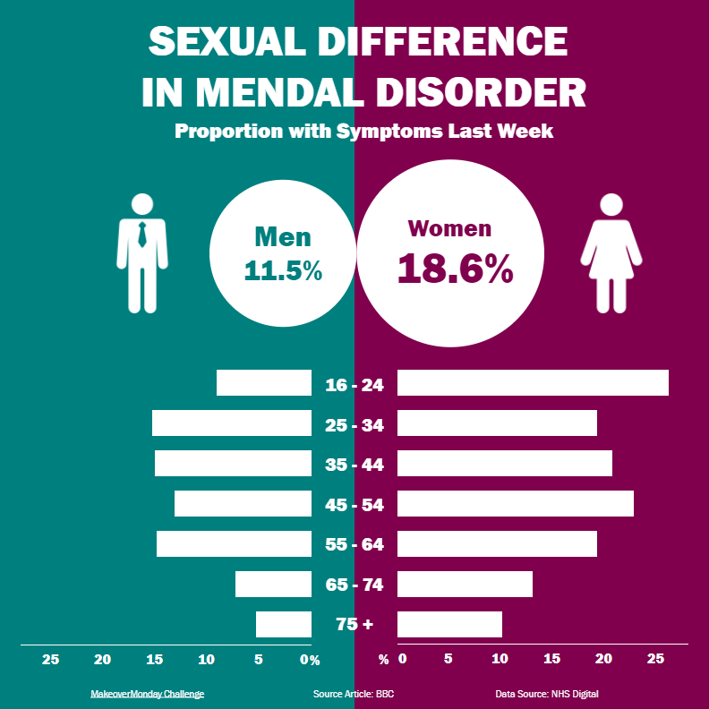

# Tableau Daily Challenge

## Day 1

#### Challenge 1: The digital gender gap

* Challenge Link: [MakeoverMonday](https://data.world/makeovermonday/2020w44)

* Original Graph: [OpFistula](https://media.data.world/dYmiAUUSDasC0oQh9H7Q_The%20digital%20gender%20divide.png)

* Reproduction: [Tableau Workbook](https://github.com/crystalwanyulee/tableau_daily_challenge/blob/main/workbooks/day1_gender_gap.twb)

## Day 2

#### Challenge 2: **Divergent Opinions on Transatlantic Alliance**

* Data Source: [MakeoverMonday](https://data.world/makeovermonday/2020w49-divergent-opinions-on-transatlantic-alliance)

* Original Graph: [Pew Research Center](https://www.pewresearch.org/global/2020/11/23/americans-and-germans-head-into-2021-with-divergent-opinions-on-transatlantic-alliance/)

* Reproduction: [Tableau Workbook](https://github.com/crystalwanyulee/tableau_daily_challenge/blob/main/workbooks/day2_alliance_btw_germany_and_us.twb)

#### Challenge 3: Can James Bond be black?

* Data Source: [MakeoverMonday](https://data.world/makeovermonday/2020w5-brexit-bond)
* Original Graph: [YouGov](https://yougov.co.uk/topics/entertainment/articles-reports/2018/10/02/idris-elba-publics-favourite-next-james-bond)

* Reproduction: [Tableau Workbook](https://github.com/crystalwanyulee/tableau_daily_challenge/blob/main/workbooks/day2_james_bond.twb)

---

#### Challenge 4: How much of your life the US has been at war

* Data Source: [MakeoverMonday](https://data.world/makeovermonday/2020w6)

* Original Graph: [Washington Post](https://www.washingtonpost.com/politics/2020/01/08/nearly-quarter-americans-have-never-experienced-us-time-peace/)

* Reproduction: [Tableau Workbook](https://github.com/crystalwanyulee/tableau_daily_challenge/blob/main/workbooks/day2_us_war_life.twb)

## Day 3

#### Challenge 5: The Distribution of the World's Wealth (Voronoi Treemap)

* Data Source: [MakeoverMonday](https://data.world/makeovermonday/2020w7-world-wealth), [CSV File for Voronoi Treemap](https://ladataviz.com/2020/01/02/build-a-voronoi-treemap-in-tableau-in-two-steps/)

* Original Graph: [howmuch](https://howmuch.net/articles/distribution-worlds-wealth-2019)

* Reproduction: [Tableau Workbook](https://github.com/crystalwanyulee/tableau_daily_challenge/blob/main/workbooks/day3_world_wealth.twb)

#### Challenge 6: Self-reported Life Satisfaction vs GDP per capita

* Data Source: [MakeoverMonday](https://data.world/makeovermonday/2020w7-world-wealth)

* Original Graph: [Our World in Data](https://ourworldindata.org/happiness-and-life-satisfaction)

* Reproduction: [Tableau Workbook](https://github.com/crystalwanyulee/tableau_daily_challenge/blob/main/workbooks/day3_gdp_life_expectation.twb)

#### Challenge 7: Visualizing 40 Years of Music Industry Sales

* Data Source: [MakeoverMonday](https://data.world/makeovermonday/2020w21-visualizing-40-years-of-music-industry-sales)

* Original Graph: [VISUAL CAPITALIST](https://www.visualcapitalist.com/wp-content/uploads/2018/10/30-years-of-music-sales-2.png)

* Reproduction: [Tableau Workbook](https://github.com/crystalwanyulee/tableau_daily_challenge/blob/main/workbooks/day3_music_revenue.twb)

#### Challenge 8: The Global Divide on Homosexuality Persists

* Data Source: [MakeoverMonday](https://data.world/makeovermonday/2020w29-the-global-divide-on-homosexuality-persists)
* Original Graph: [Pew Research Center](https://www.pewresearch.org/global/wp-content/uploads/sites/2/2020/06/PG_2020.06.25_Global-Views-Homosexuality_0-11.png)
* Reproduction: [Tableau Workbook](https://github.com/crystalwanyulee/tableau_daily_challenge/blob/main/workbooks/day3_homosexuality_persists.twbx)
* [Tableau Public](https://github.com/crystalwanyulee/tableau_daily_challenge/blob/main/images/day3_homosexuality_persists.png?raw=true)

#### Challenge 9: Comparing common mental disorder by sex

* Data Source: [MakeoverMonday](https://data.world/makeovermonday/2020w27-comparing-common-mental-disorder-by-sex)
* Original Graph: [BBC](https://learningtableaublog.files.wordpress.com/2020/07/screenshot-2020-07-04-at-16.52.48.png)
* Reproduction: [Tableau Workbook](https://public.tableau.com/views/day4_mental_disorder/Dashboard?:language=en&:display_count=y&:origin=viz_share_link)

#### Challenge 10: The Rise of Soccer

* Data Source: [MakeoverMonday](https://data.world/makeovermonday/2020w24), [CSV File for Hex Map](https://www.sirvizalot.com/2015/11/hex-tile-maps-in-tableau.html)

* Original Graph: [FIVETHIRTYEIGHT](https://fivethirtyeight.com/wp-content/uploads/2015/07/morris-datalab-wsoccer-1.png?w=575)

* Reproduction: [Tableau Workbook](https://public.tableau.com/views/day4_women_soccer/Dashboard2?:language=en&:display_count=y&:origin=viz_share_link)

